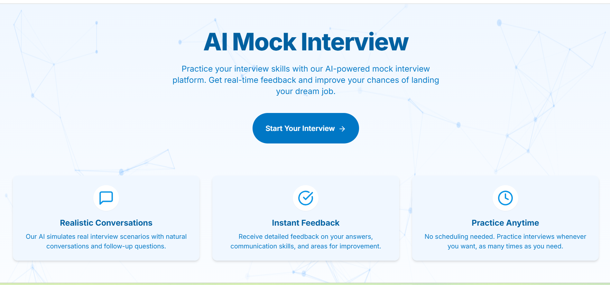
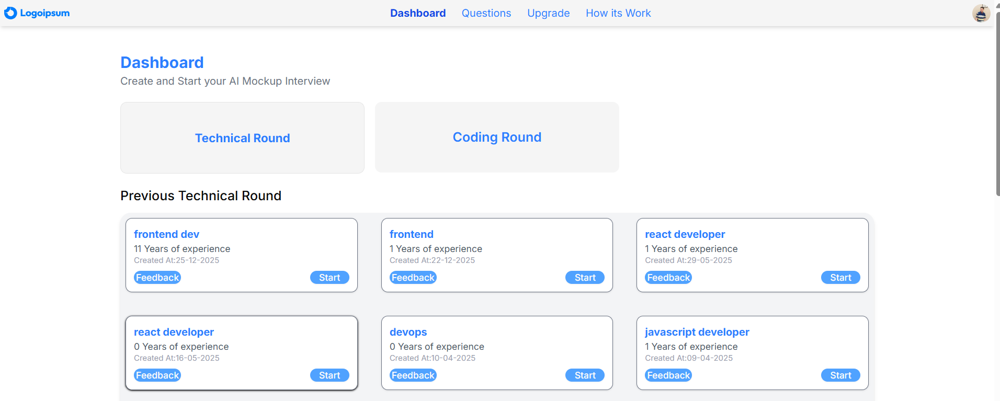
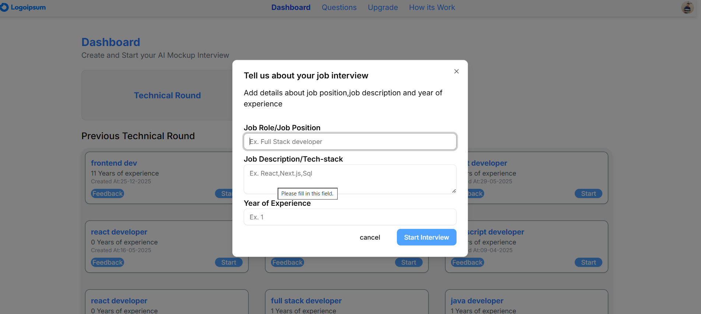
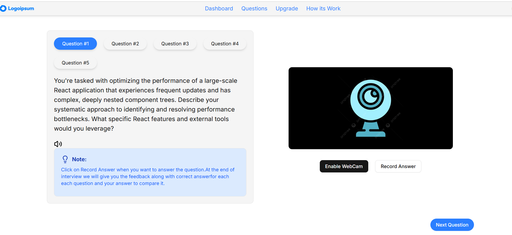
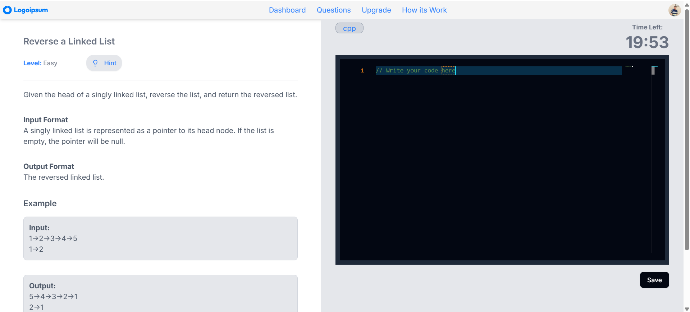
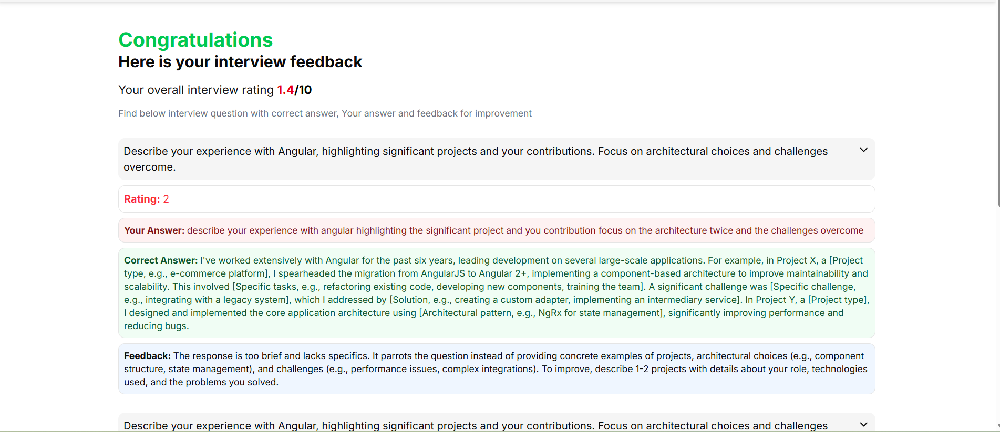

# 🎓 AI-Powered Mock Interview System



Welcome to the **AI-Powered Mock Interview** — a smart interview practice platform that helps users prepare for both **technical** and **coding interviews** with real-time feedback generated by **Gemini Flash**.

This application provides:
✔ Dynamic, random interview questions  
✔ Domain-specific customization  
✔ Intelligent answer evaluation  
✔ Detailed feedback for every response  

---

## 🚀 Table of Contents

1. 🧠 About the Project  
2. 📌 Features  
3. 🖼️ Screenshots  
4. ⚙️ How It Works  
5. 📍 Usage Instructions  
6. 🙌 Future Enhancements

---

## 🧠 About the Project

This project is an **AI-driven mock interview platform** designed to help users practice interviews with realistic simulated questions.  
The system uses **Gemini Flash** to generate questions based on the user’s field of interest and provides **dynamic verification and feedback** for every answer.

Whether you’re preparing for:
- Technical rounds 🛠  
- Coding interviews 💻  
- Domain-specific assessments 🎯

This tool gives you an **interactive and personalized practice environment.**

---

## 📌 Key Features

✔ Choose your **field of interest**  
✔ Adaptive question generation with AI  
✔ Two interview modes:
- **Technical Round**
- **Coding Round**  
✔ Intelligent answer validation  
✔ Real-time feedback  
✔ Easy UI for seamless interaction

---

## 🖼️ Screenshots

### 🏠 Home Screen
Welcome page where users enter their name and select interview preferences.



---

### 📂 Select Field of Interest
User selects the domain in which they want to be interviewed.



---

### 🔍 Technical Interview Interface
Gemini Flash generates technical questions dynamically and records user answers.



---

### 💻 Coding Interview Interface
Interactive coding questions are presented based on the user’s selected field.



---

### 📊 AI-Powered Feedback
After users submit their answers, Gemini Flash evaluates and offers detailed feedback.



---

## ⚙️ How It Works

1. User enters their **name** and selects **interview preferences**.
2. Based on the selected field, the app sends a request to **Gemini Flash**.
3. Gemini Flash generates **dynamic interview questions**.
4. User answers each question.
5. The answer is sent back to Gemini for **evaluation and feedback**.
6. The system displays **feedback** instantly.

---

## 📍 Usage Instructions

1. Clone the repository:
   ```bash
   git clone https://github.com/Ghalib18/prep-with-me.git
